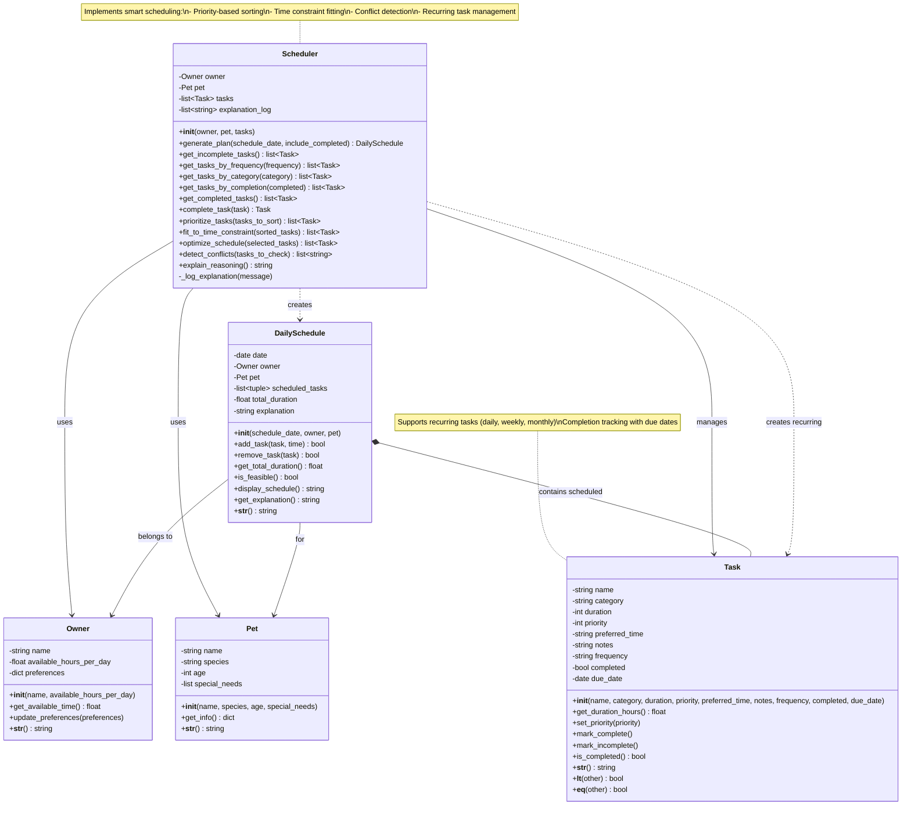

# PawPal+ Final UML Diagram

## Updated Class Diagram (Mermaid.js)



## Key Changes from Initial UML

### 1. **Task Class Enhancements**
**Added Attributes:**
- `frequency: string` - Supports "once", "daily", "weekly", "monthly"
- `completed: bool` - Tracks task completion status
- `due_date: date` - Tracks when recurring tasks are due

**Added Methods:**
- `mark_complete()` - Marks task as completed
- `mark_incomplete()` - Resets task to incomplete
- `is_completed() -> bool` - Returns completion status

### 2. **Scheduler Class Enhancements**
**Added Filtering Methods:**
- `get_incomplete_tasks() -> list[Task]` - Returns only incomplete tasks
- `get_completed_tasks() -> list[Task]` - Returns only completed tasks
- `get_tasks_by_frequency(frequency) -> list[Task]` - Filter by frequency
- `get_tasks_by_category(category) -> list[Task]` - Filter by category
- `get_tasks_by_completion(completed) -> list[Task]` - Filter by completion status

**Added Core Methods:**
- `complete_task(task) -> Task` - Completes task and creates new instance for recurring tasks
- `detect_conflicts(tasks_to_check) -> list[string]` - Detects scheduling conflicts
- `_log_explanation(message)` - Private helper for logging explanations

**Updated Method Signatures:**
- `generate_plan(schedule_date=None, include_completed=False)` - Added optional parameters
- `prioritize_tasks(tasks_to_sort=None)` - Added optional parameter

### 3. **DailySchedule Class Enhancements**
**Added Attributes:**
- `explanation: string` - Stores scheduling reasoning explanation

**Updated Attributes:**
- `scheduled_tasks: list[tuple]` - Clarified as list of (time, task) tuples

### 4. **New Relationships**
- `Scheduler ..> Task : creates recurring` - Scheduler can create new Task instances for recurring tasks

## Architecture Highlights

### **Recurring Task Flow**
```
User completes daily task → Scheduler.complete_task()
    ↓
Task marked as completed
    ↓
New Task instance created with due_date = tomorrow
    ↓
Added to Scheduler's task list
```

### **Schedule Generation Flow**
```
Scheduler.generate_plan()
    ↓
1. Filter incomplete tasks
    ↓
2. Prioritize tasks (by priority, then duration)
    ↓
3. Fit to time constraint (greedy algorithm)
    ↓
4. Optimize schedule (group by time period)
    ↓
5. Detect conflicts (check time period overflow)
    ↓
6. Create DailySchedule with selected tasks
```

### **Conflict Detection Strategy**
- Lightweight, non-blocking warnings
- Checks for time period overflow (>4 hours per period)
- Warns when >3 tasks in same time period
- Returns list of warning strings instead of raising exceptions

## Implementation Notes

1. **Immutability Considerations**: Tasks use `__eq__()` to compare definition, not completion status
2. **Sorting Strategy**: `Task.__lt__()` enables natural sorting by priority (high→low) then duration (short→long)
3. **Greedy Algorithm**: `fit_to_time_constraint()` uses greedy selection for time optimization
4. **Time Period Grouping**: `optimize_schedule()` groups by morning→afternoon→evening→unscheduled
5. **Recurring Task Design**: Completion creates new instances rather than modifying existing tasks
